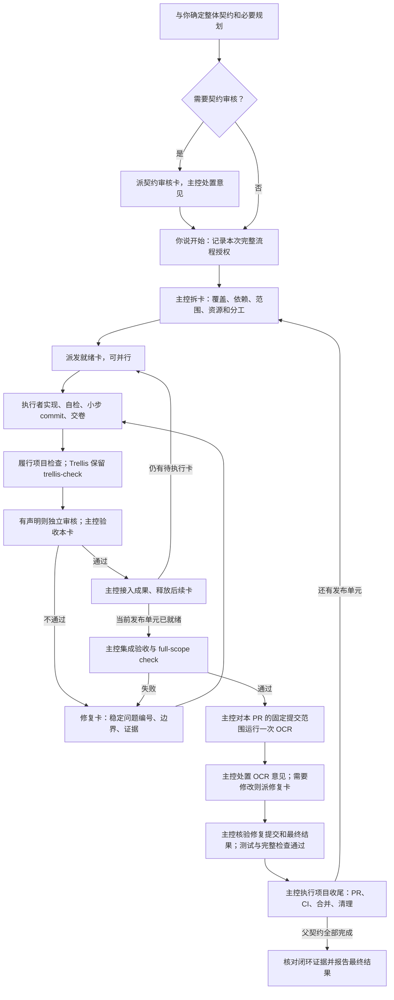

# Herdr 自动拆卡与 Trellis 接入执行计划

状态：用户已授权交给 Grok 实施，并同步 Trellis 远程模板仓库、应用到 sanctions-radar。日期：2026-09-09。

本文件记录已确定的产品边界与实施步骤。2026-09-09 用户追加授权：由 Grok 实施、本机安装通用技能、同步 `kakamisamas/trellis-personal-marketplace`，并把更新应用到 `sanctions-radar`。实现、必要测试、任务分支及 PR 准备交给 Grok；主控收卷验收后继续远程合并、需要的模板发布和项目应用闭环，不再请求一次收尾确认。原文各处“计划阶段”约束只描述编写计划的上一阶段。

派发前现场：模板仓实际分支为 `release/v1.4.1`；sanctions-radar 在 `main`，有三处已有未提交改动：`ops/deploy/templates/deploy.json`、`site/src/lib/paths.test.ts`、`site/src/lib/paths.ts`。这些改动及既有 heartbeat worktree 不属于本任务，须保留；实施使用本任务独立目录。实际执行前重新核对，不按旧基线覆盖现场。

## 1. 目标与已确定的决定

把现有 `herdr-dispatch` 扩展成可独立复用的派卡能力：用户与主控确定整体任务契约并说“开始”后，主控自主拆卡、安排依赖和并行、收取成果、处理修复、完成整体验收，再按项目规则合并和闭环。

交付形态明确为 **本地 skill + 任务模板/参考规则 + Python 脚本**，统一由 Skills Manager 管理。通用能力以 Herdr 为运行载体，可跨 Trellis 与普通项目复用。Trellis workflow 保存接入规则和指针，不复制另一份派工引擎。

已确定的行为：

1. 人负责整体任务契约、关键取舍和开始实施的决定。主控在契约范围内自行细化、拆分、合并和重排执行卡，不逐卡请求用户立项或批准。
2. Trellis 的规划、必要设计、行为切片、质量检查、PR 和归档纪律继续适用。自动拆卡把实施计划转成具体工作，不取代开始前必要的规划。
3. 可以先单独派契约审核卡，审核需求、设计和验收条件；此时仍处于规划阶段，审核不自动启动实现。
4. 执行卡默认由执行者自检，使用同一执行模型；Trellis 的 `trellis-check` 按原工作流继续执行。独立审核卡按用户、父契约或已确定的审核策略声明启用，不为每张卡增加一轮独立审核。
5. 修复是执行工作的一个阶段，默认交给原执行者，不增加常驻“修复者”角色。
6. 主控负责子卡接收、依赖释放、集成、父契约整体验收、OCR 意见处置和最终合并清理。脚本管理事实和状态，不凭格式正确替主控判定业务通过。
7. 卡片有派工生命周期；一个已批准的 Trellis 任务保留一个原生生命周期。执行卡不自动变成原生 Trellis child task，不逐卡调用 create/start/archive，不新增卡片归档 hooks。
8. 小步 commit 保存成果和恢复点。OCR 在每个待合并 PR 的产品改动基本定型、完整检查通过后运行一次；修复提交用测试和完整检查验证，同一个 PR 不重复 OCR。
9. 用户明确启用完整派卡流程并说“开始”，授权本任务及其派生卡继续到既有门禁通过后的提交、PR、合并、归档、清理；恢复和返工继承该授权，不再等待一次“收尾”。
10. 独立派执行、单独派审核仍可直接使用；“派审核”本身不等于启用自动实施和 Git 收尾。非 Trellis 使用不依赖 `.trellis/`。

没有必须继续向用户确认的产品决策。字段名、模块拆分和命令名由实现者在以下语义边界内确定；本文的候选名称不冒充已有 API。

## 2. 事实基础与改造位置

### 已检查的本地事实

| 对象 | 当前事实 | 对改造的影响 |
| --- | --- | --- |
| `herdr-dispatch` | 已有 submit、watcher、publish、collect、accept/reject、resume、cleanup | 复用单轮机制，在其上增加整组任务协调 |
| 写入冲突检查 | 对绝对路径做重叠判断，有全局写入范围登记 | 独立 worktree 还需按仓库身份和相对路径判定逻辑冲突 |
| 结果协议 | 区分交卷状态与审核 verdict，支持不可变轮次和结果指纹 | 保留区别，整组状态不能把“审核完成但 fail”当作代码通过 |
| 权限与触发 | 当前主要按单次点名派工，完整流程授权未表达 | 增加完整流程入口和授权继承，保持单次入口语义 |
| 执行目录 | 当前终端从本轮制品目录启动，任务另有 `cwd` | 必须显式传递工作目录、任务上下文和写入边界，不能依赖偶然 hook 注入 |
| 源码与安装副本 | `herdr-dispatch` 内容一致；`trellis-wrap-up` 安装副本有源码没有的恢复规则 | 先保留并整合已安装改进，再走管理器更新 |
| Skills Manager | `herdr-dispatch` source_type 为 local，source_ref 指向 local-src；已部署到多个 harness | 在源目录维护，更新中央副本和现有部署，保留原 skill 身份 |
| Trellis 父子任务 | 父子关系不负责依赖调度 | 本次用派卡运行记录表达执行图，不借用原生 task 状态模拟调度 |
| Trellis 检查 | `trellis-check` 允许自动修复；独立 review 模式只读 | 不把两者强行套进同一只读 reviewer 角色 |
| Trellis OCR | Phase 2.2 主会话调用，每个 PR 一次；3.5 写入 PR 记录 | 保留 OCR 边界，增加 finding 到修复卡的连接 |
| Trellis 收尾 | workflow 阶段提示和 3.4 都要求等待“收尾” | 同时调整路由、阶段提示和收尾入口，避免规则互相冲突 |
| workflow 分发 | marketplace 传输 workflow.md，不自动分发本地派工包 | workflow 指向本地技能；安装检查不承诺自动把技能带到其他机器 |

基线：本计划编写时 marketplace 位于 `main`，HEAD 为 `8caf11a`（v1.4.1 引用）；实施前重新读取实际状态，不假设该 SHA 永久不变。该仓没有 `.trellis/` 或 `.codegraph/`，此文件不是已创建的原生 Trellis 任务。

### 文件所有权

| 位置 | 用途 |
| --- | --- |
| `~/.skills-manager/local-src/herdr-dispatch/` | 通用派工 skill、模板、脚本和测试的维护源 |
| `~/.skills-manager/skills/herdr-dispatch/` | Skills Manager 管理的安装副本；workflow 的稳定指针目标 |
| `~/.skills-manager/local-src/trellis-wrap-up/SKILL.md` | 收尾入口，识别已保存的任务授权 |
| `~/.skills-manager/skills/trellis-wrap-up/SKILL.md` | 现有安装改进须先整合，避免回退 |
| `workflows/solo-github-flow/workflow.md` | Trellis 的模式路由、授权接入和原生步骤衔接 |
| `README.md`、`tests/`、必要的安装检查 | 分发说明与接入验证 |
| `$HERDR_DISPATCH_HOME`，默认 `~/.local/state/herdr-dispatch/` | 运行状态、轮次、投递与结果证据；与 skill 安装目录分离 |

产品 workflow 使用 `~/.skills-manager/...` 或技能发现路径，不硬编码 `/Users/davidl`。在非 Trellis 项目中，通过同一 skill 使用通用协议；Trellis 专属规则只在适配分支加载。

## 3. 目标执行流程



Trellis 每次提交、归档和 PR 的具体先后沿用其 3.3–3.5。图中的“收尾”是概括，不另建一套与原步骤不同的 Git 操作清单。主控的最终验收发生在实际候选版本合并之前，最后一个发布单元必须覆盖父契约整体要求；闭环后的核对是验证合并和清理事实。存在多个 PR 时，父任务最终完成只发生在全部必需交付完成后；中途发布不反复归档父任务。

### 检查职责

- 执行者负责本卡的行为切片、必要测试、自检、进度与提交。未声明独立审核时，不自动选择另一模型再审一遍。
- `trellis-check` 继续执行原项目规范、契约、测试及跨层检查，并保留现有自动修复能力。派卡模式由主控安排检查阶段，避免执行者递归启动整套 Trellis 流程。
- 需要单独 check agent 的平台，由主控统一派发并授予该阶段唯一写入权；inline 平台仍按既有 skill 检查。不能同时让 check agent 与原执行者写同一 worktree。
- 独立审核卡的对象可以是契约、执行成果、跨卡接口或明确的代码范围；代码规范检查复用项目规则，不规定它只能审编排。它的价值是独立视角和可追踪结论，不是追加一个固定重复门禁。
- 独立 reviewer 只读项目并写报告。需直接修复的检查仍属于可写的执行/检查阶段，不把 `role=reviewer` 改成可写角色。
- 主控裁定各层证据是否足够、是否接收成果及释放依赖。脚本产生的 ready 状态仅表示机械条件满足。

## 4. 从原任务卡吸收的方法

来源：[用户分享的任务卡](https://i.getmoshi.app/dO0Ue1yi)。保留其针对实际失败模式的操作规则，并映射到本地已有协议。原文引用的私人 issue、脚本及审核纪律未随分享提供；实施不得声称这些依赖已取得或已验证。

下表是方法到本地实现的对应清单；验收时逐项记录落点，避免只借用标题。

| 原文方法 | 本地采用方式 | 主要落点 |
| --- | --- | --- |
| 拆卡时去掉没有产物流转的依赖 | 每条边记录所消费的接口、文件或提交；无消费关系不设串行边 | 拆卡指引、计划校验 |
| 并行前检查独占资源 | 记录端口、DB、浏览器 profile、单例进程、测试套件；隔离或排队 | 资源声明与占用检查 |
| 按验证耗时控制并发 | 有实测基线时使用；没有时保守启动并记录实测；全量检查按发布单元统一安排 | 调度说明、并发容量 |
| 完成条件必须可观察 | 每项带行为或命令、期望结果、证据路径和负责人 | 执行模板、主控验收 |
| 先复现，区分根因测量与推断 | 修复卡保留原始复现；未验证根因显式标注，允许执行者质疑 | 事实字段、修复模板 |
| 清晰的基线、分支与唯一写入者 | 由工具捕获实际值，不手编 SHA 或分支；变更所有权明确交接 | Git 产物记录、执行模板 |
| 修改范围要包含受影响的测试和调用方 | 拆卡检查配套测试、构造方、消费者、配置值重复声明和删除依赖 | 拆卡检查、范围验证 |
| 文件级范围提高并行度 | 精确路径优先；跨 worktree 以仓库身份和相对路径比较；实际绝对路径照常检查 | 范围锁与预检 |
| 对验证基础设施单独声明修改 | 任务确需改 CI 或测试入口时卡面明确理由和范围；保留实际项目规则 | 模板条件条款 |
| 约束与实现假设分开 | 目标、硬约束、已定决定和可调整实现各有位置；不以猜测锁死执行 | 契约与模板 |
| 复杂状态与失败路径用矩阵 | 仅状态机、并发、恢复等卡加载；检查证据不可得时的含义 | 条件参考说明 |
| 执行者指出错误判据 | 判据与目标矛盾时给证据，主控处理；不得靠放宽断言交卷 | 执行、修复模板 |
| 可独立验证的单元及时 commit | Git 执行卡小步提交并报告范围内全部提交；阶段提交不等于整卡验收 | Git 交付检查 |
| 长任务进度随成果保存 | 唯一卡片路径、追加里程碑、结论、关键决定、否决方案和下一动作；与提交一起保存 | 进度模板、恢复 |
| 反向验证先保存真实修复 | 故障注入前保存成果，只恢复注入处；转红必须是被验断言失败 | 条件测试指引 |
| 接口集成使用真实生产者产物 | 消费端至少验证真实 fixture、生成契约或真实联调结果；自造 mock 不能独立证明接通 | integration 卡验收 |
| 并发/时序问题重复验证 | 按原方法至少多轮验证关键范围，次数与结果写明；不把少量全绿说成故障率为零 | 条件验收条款 |
| 克制增加抽象和兼容分支 | 新抽象说明消费者或必要性；测试失败修事实，不用无根据 fallback 遮盖 | 执行与检查指引 |
| 修复按根因和 findings 组织 | 保留稳定问题 ID、根因组、引入位置/提交及待修范围；根因未知允许调查 | 修复协议 |
| 任务完成与被审对象通过分开 | 继续使用 status 与 verdict；派工 accept 与代码通过、最终合并分别记录 | 现有结果协议 |
| 阻塞上行不假装终态 | 问题和现场独立记录；缺报告、查不到进程均不能据此推出成功 | 事件与恢复 |
| 跨发布边界考虑 SHA 引用 | 只有下游真实依赖原 SHA 时处理发布策略；不全局取消现有 squash | Trellis/项目适配 |
| 人用功能同时交付使用说明 | 本卡声明说明文件，主控照说明走通使用路径 | 面向用户卡的验收 |

适配而非照搬的部分：

- 保留现有 `task.json` → `request.md` 和 `result.json` → `published.json` 的机读机制，不另加一套解析 Markdown 字段或 HTML outcome 的程序。
- 原文的 `Depends-On` 要求依赖已并入主干，是其具体发布策略。本地依赖满足条件为：前卡已验收，且指定成果已进入后卡的实际基线；无需为了运行后卡先合并到主分支。
- 原文执行器角色声明中的作者全局 AGENTS 例外、Linux/systemd 参数、私人绝对路径、特有 hooks 和统计记分卡不移植；改为本地明确的执行角色和项目约束。
- 原文没有 OCR 流程。OCR 完整采用本地 workflow，不把小步 commit 推断成逐提交 OCR。
- 原文行数预算里的软性收缩办法可借鉴；Trellis 现有 2500 规划预算和 3500 CI 硬限制按发布单元保留，不能用多张小卡规避聚合 PR 的限制。
- 源码已经落盘但未提交时，恢复工具应如实展示可抢救内容；“缺少提交证据，不能验收”不等于“文件已经丢失”。

## 5. 协议与持久化设计

### 三层记录

| 层级 | 保存什么 | 写入者 |
| --- | --- | --- |
| 整体运行 `run` | 契约快照/版本、授权、项目适配、执行配置、卡图、发布单元、总体进度 | 主控通过脚本 |
| 逻辑卡 `card` | 覆盖哪些要求、依赖产物、范围、资源、执行者、当前轮次、成果与未解决问题 | 主控通过脚本 |
| 派发轮次 `dispatch/round` | 不可变请求、实际会话、投递、报告、状态和结果指纹 | 复用现有单轮实现 |

使用现有状态目录增加整组记录；不新建服务、数据库或独立模型调用程序。字段应表达调度真实需要的事实，不为每一步再增加一个开关。

`run` 至少需要表达：

- 本次整体任务身份、契约位置/内容指纹和需求编号；Trellis 原生任务只是可选关联。
- 单次执行、单次审核或完整运行的授权边界；开始授权的来源、关联契约和收尾范围。
- 项目目录、协调目录、任务集成目录、Git 基线、目标分支及后续实际 PR。
- 已确定的 executor/reviewer harness 与模型选择、并发容量和项目质量规则入口。
- 卡片与需求的覆盖、实际产出依赖、逻辑范围和运行资源。
- 子卡接收记录、未解决 findings、集成证据、各 PR 的 OCR 及收尾检查点。

实现规则：

1. 主控判断怎样拆；脚本检查缺失引用、循环、范围冲突、资源占用、产物缺失、容量和状态一致性。
2. 依赖已接收但尚未进入后卡目录时，后卡仍不可派；记录确实消费的版本。
3. 契约普通补充解释可由主控处理并留记录；影响已批准的行为、范围或关键取舍时回到用户。卡片调整本身不抹去原授权，也不自动扩大授权。
4. 每次修改已派发要求使用新轮次；保留旧请求与结果。卡 ID 稳定，业务修复计数不能通过换 dispatch ID 清零。
5. 主控 accept 完整审核交付且 verdict 为 fail 时，记录审核完成并保持代码待修；不能因此释放成功依赖。
6. 正常回报到达后由事件唤醒主控推进，不以循环调用模型轮询状态。一次 submit 返回仅代表该卡已登记，不代表整批已全部派完。
7. 对同批就绪卡可依次快速 submit，使其并行运行；每次实际派发前重新持有范围和资源，防止检查通过后又被另一批抢占。
8. 无法确认是否投递成功时沿用现有 unknown 处理，不自动重发同一工作。缺报告不能凭 idle/done 接收。
9. 保留现有每个执行者同一时刻一个任务、会话身份核验、不可变 publish、claim 后裁决及取消语义。
10. 同一 must_fix 连续两轮未解决或业务修复达到现有上限时，主控带已有证据报告需要干预的点；不让正常检查/审核轮次耗尽修复预算。

### 源码、运行事实和最终记录

- Skills Manager 管理技能代码；更新 skill 不修改运行目录中的卡片状态。
- 详细投递、事件和报告保存在运行目录。Trellis 父任务只保存稳定运行 ID/指针及最终交付摘要，不复制一份可独立修改的调度状态。
- 长卡进度采用本卡唯一文件路径，声明在允许范围内。任务集成目录中的汇总由主控写，执行者不共同修改一个汇总 JSON。
- 程序不依赖父任务一直位于未归档路径。Trellis 归档前捕获身份、目录、分支和 PR，归档后依照运行记录恢复收尾。
- 卡片运行记录、提交证据和进度在清理后仍可查；清理工作目录不能同时删除唯一恢复证据。

## 6. 实施步骤与完成判据

### S0：固定基线、保留现有能力

范围：本地两个 skill 源/安装副本、marketplace 工作区，以及本计划执行记录。

1. 记录实际 Git 状态、源码文件指纹、Skills Manager 的 source_ref、skill ID、preset 和部署对象。
2. 比对 `trellis-wrap-up` 源码与安装版，保留安装版新增的故障恢复和归档后恢复规则，再形成统一维护源。
3. 运行现有派工测试和 marketplace 必要检查建立基线；旧失败单列证据，不先改测试期待。
4. 对本地非 Git 源码准备隔离工作副本和可恢复基线；需要 Git 里程碑时只在该工作副本建立仓库，不把整个 Skills Manager 纳入 Git。

完成：有准确基线、源码合并依据、测试结果和恢复路径，现有运行中的 watcher 未被切换或热替换。

### S1：改造 skill 与卡片模板

主要范围：`SKILL.md`、`references/`、`scripts/templates.py`，以及协议中必要的新增字段。

1. 保留一个 `herdr-dispatch` 技能入口，区分单次派执行、单次派审、契约审核、完整运行和恢复。
2. 把“只在每次用户点名时可派”“submit 后本轮即结束”“不创建 worktree”等规则限定到适用分支；完整运行按父授权持续推进。
3. 编写拆卡参考规则、执行模板、审核模板及修复模板。审核模板支持契约和代码对象；修复模板复用执行者与交卷机制。
4. 通用模板携带足够上下文、目标/非目标、基线、唯一写入者、范围、事实/假设、验收和交付要求；复杂状态、integration、并发、文档交付等条款按条件加入。
5. 记录第 4 节每项方法落在哪份参考规则、模板段或校验中，不把作者全部事故叙事塞入每张卡。
6. 默认执行配置依次沿用用户指定、本任务已确定配置、已安装配置；完整流程可以继承可确认的当前 harness。模型只写可确认的实际配置，无法得知精确 ID 时注明使用 harness 默认，不声称已固定同一精确模型。
7. 保留单次审核已有默认人选；未声明独立审核的执行卡不触发该默认人选。
8. 完整流程初始并发上限建议为 2 个执行者；主控按实际资源、测试开销及已有配置调整，不要求用户逐批选择并发数。独立审核和检查也计入实际运行容量。

完成：同一技能可生成四种自洽请求：普通执行、契约审核、代码审核、指定 findings 的修复；默认执行只要求自检，所有条件条款都有触发入口。

### S2：增加整体运行与确定性调度

主要范围：扩展 `herdr_dispatch.py`、`protocol.py`、`store.py`、`runtime.py`；按职责新增少量运行计划/调度模块。

1. 增加 run/card 记录和旧协议兼容。已有 v1 任务继续可 collect、accept/reject 和 resume；未知新字段不能悄悄丢弃后宣称支持。
2. 提供建立运行、校验计划、列出/派发就绪卡、读取整组进度和恢复入口。候选组织为现有 CLI 的 `run` 命令组，实施时以真实 `--help` 为准。
3. 校验依赖无环、引用存在、契约要求有对应卡、依赖产物真实存在；语义覆盖充分与否仍由主控判断。
4. 扩展范围判定：实际路径检查 + Git common-dir 识别同仓 + 规范化相对路径比较。独立目录允许并行读，写冲突需明确串行或先调整拆法。
5. 增加声明资源占用和并发容量；范围/资源预留与派发持久化保持一致，失败不会留下无法恢复的永久占用。
6. 复用现有 watcher 事件；主控被唤醒后处理结果、更新卡图并派后续就绪卡。主控繁忙时延迟，不插入其他会话，不另建一个无人知晓的模型主控。
7. 增加整组取消与恢复：停止后续派发，保留正在运行者与取消后的写入证据；沿用现有“不等于强杀执行者”的含义。

完成：A、B 无依赖可并行，C 消费两者；A 完成不足以释放 C；B 失败进入修复且无关卡可继续；重启后不重复投递或重复接收。

### S3：Git 成果、执行隔离与检查交接

主要范围：通用 Git/worktree 辅助模块、请求渲染、产物校验和恢复说明。

1. 有 Git 的完整运行使用任务集成分支；并行可写卡各自独立 worktree。串行工作可复用本运行目录，但任意时刻仅一个写入者。
2. 主控创建并记录实际路径、分支和 base SHA；执行者在指定分支工作，不另建一条未登记分支。
3. 卡片从其实际前置成果建立基线。主控接收后把成果接入任务分支；记录提交映射，避免 merge/cherry-pick 后还使用旧 SHA 判断清理和验收。
4. 执行者按可验证单元 commit，报告 `base..head` 的完整改动及提交，而非仅展示最后一条 commit stat。部分提交是恢复成果，不自动满足整卡完成。
5. 长卡进度随里程碑保存。异常恢复先核验已有提交和未提交文件，再明确下一动作；不从零重做或整文件还原吃掉真实修复。
6. 在执行者交出写入权后安排既有 `trellis-check`；检查修复形成的新提交加入卡片产物。若原轮次已经 publish，检查引起的变更必须通过后继可写检查/修复轮记录新 head 和证据，不修改已发布结果，也不使用原报告验收新代码。父任务全量验收与卡级检查范围分别记录，避免每个小卡同时运行相同重型全量套件。
7. 独立审核固定 base/head 或内容快照；审核期间被审对象变化需说明失效，不拿旧 pass 验收新代码。
8. 非 Git 的文件/文档派工仍可运行，以文件指纹及快照交付，不强制创建 Git 仓库、PR 或提交。

完成：临时真实 Git 仓库中两张卡互不污染，产物进入集成分支后后卡确实可调用它；跨 worktree 写同一相对文件被识别；check 写入有唯一所有者；卡的全部修改都有证据。

### S4：修复、验收与 OCR 连接

主要范围：findings/修复数据、收卷后推进、项目验收接口、Trellis 条件参考说明。

1. findings 使用稳定 ID，记录来源是独立审核、主控验收、集成失败还是 OCR，以及被审版本、证据、对应卡和处置。
2. 主控决定哪些意见成立；可修问题派给对应执行者，跨卡问题派集成修复卡。执行者可以给出有证据的异议，最终处置由主控记录。
3. 修复在原逻辑卡下增加轮次/关联修复卡，继承契约和授权；连续失败计数跨派发 ID 保留。
4. 父契约的每项验收关联实际集成版本与验证结果。检查命令运行在真实目标目录，脚本退出 0、报告格式完整或查不到失败均不足以证明业务完成。
5. 明确发布单元：卡不是 PR；单个可独立交付卡可形成 PR，多卡也可聚合一个 PR。主控检查累计变动规模和接口完整性后决定划分。
6. Trellis 在每个 PR 的产品范围基本固定、full-scope check 通过后由主控调用一次 OCR；记录实际审查 base/head、产品范围和状态。PR 尚未创建时先以运行内发布单元关联，创建后绑定真实 PR。
7. OCR 有效意见进入修复卡。修复提交与原 finding 对应，主控核对后更新 PR disposition；随后重跑受影响测试和 full-scope check，不对同一 PR 再运行 OCR。
8. OCR 后的 CI 失败或集成缺陷也可派修复卡。保存新 head 与验证证据，不把 OCR 针对旧 head 的报告说成审过新 head；新增无关功能进入后续发布单元，正常修复不伪装成新 PR 来绕过一次 OCR 约定。
9. 保留 OCR 不可用/部分/失败的既有显式记录政策、覆盖计数及意见逐项处置；不另造比原 workflow 更强的重复审核门禁。

完成：可重放一条 OCR finding → 修复卡 → 新 commit → 验证 → disposition 的链路；同一 PR 的 OCR 调用数为 1，修复未完成时不能合并；审核交付 fail 不释放成功依赖。

### S5：Trellis 指针接入与授权继承

主要范围：`workflow.md`、通用 skill 的 Trellis 参考分支、`trellis-wrap-up/SKILL.md`，以及接入测试。

1. 在 planning 路由增加可选契约审核入口；审核完成后仍回到既有规划和用户“开始”节点。
2. 在 1.4 激活、1.5 就绪条件明确：完整派卡模式的开始授权记录到父任务关联运行，不逐卡再次立项、启动审批。
3. 同步 `Active Task Routing`、Phase 2.1/2.2、`in_progress` 与 `in_progress-inline` 的提示。先判断是否启用完整派卡模式，再走对应执行方式，避免既派 Herdr 又重复派原生 implement agent。
4. 外部执行者接收清晰的 `Active task`、`Workdir`、卡片角色与完整上下文。并行 worktree 需要的父契约/spec 使用明确只读来源或受控快照，不依赖它本地 `task.py current` 能自动找到父任务。
5. 执行者直接承担指定实现/检查，不递归拆卡，不触发用户立项/收尾确认。主控独占调度、父任务状态与原生归档操作。
6. workflow 指针读取 `~/.skills-manager/skills/herdr-dispatch/SKILL.md`，再按条件进入 Trellis 参考分支；原有项目 spec、TDD、质量规则和 CodeGraph 工作目录约束保留。
7. 3.4 根据当前任务已保存的完整流程授权报告后继续；非派卡任务沿用原来的开始和收尾规则。`trellis-wrap-up` 同时识别当前“收尾”及已存在的任务授权，保留已安装恢复规则。
8. 使用现有 workflow-state 块让已有 hooks 注入更新后的提示，不新增状态枚举，不改 hook 解析器，不给每张卡加原生 task/archive hook。
9. 3.5 仍由主控核验实际 PR head、测试 CI、合并条件并操作；临时失败修复后继续。归档后不丢运行身份，恢复从已完成步骤之后接续。
10. 卡片 worktree 的清理由派工工具按记录处理；父 Trellis worktree 继续按现有流程清理。卡分支未直接拥有 PR 时，使用已验证集成映射和最终合并证据，不谎造卡片 PR，也不放宽全局 GC 对其他任务的要求。
11. 默认把可用于修复的卡分支保留到关联发布单元通过并完成合并，避免 OCR 出现问题时成果已被清掉。清理只操作本运行创建、干净且已证明交付的资源。

完成：候选 workflow 在原生 Trellis 骨架中可读取，两个 in_progress 分支均正确路由；一个父任务、若干卡，只进行一次父任务原生归档；开始后无需第二个用户确认，普通非派卡模式仍可正常走原有流程。

### S6：验证、安装与交付

主要范围：两个包的测试、README、必要的本地指针能力检查、管理器更新及候选安装验证。

1. 先完成通用派工的 fake Herdr 测试和真实临时 Git 场景，再做 Trellis 适配验证。
2. 验证本地指针和所需协议能力是否存在。仅启用派卡模式时检查依赖；无本地技能的普通 Trellis 任务不受影响。缺依赖清晰报缺失入口，不临时复制未知脚本或冒充已可派发。
3. 源码通过后使用当前 Skills Manager 的 `skills update` 和部署/同步入口更新已登记技能；先读实际 `--help`，保留 skill ID、preset、source_ref 和现有部署。
4. 读取源码、中央安装副本和各 harness 实际目标，核对内容指纹与 CLI 能力。仅编辑 local-src 不算交付已生效。
5. 运行中的 watcher 沿用自己的旧进程状态；新版本通过显式恢复或新运行使用，不声称热更新。旧轮次的读写兼容必须验证。
6. marketplace 使用候选 workflow 做安装 smoke，README 说明本地依赖与启用方式；后续模板发布采用一致的版本引用。已有业务仓升级采用逐项目预览合并，不覆盖未核对的本地改动。
7. 补两条可直接使用的示例：非 Trellis 单独契约/代码审核，以及 Trellis 契约确认后“开始”的完整运行。
8. 交付报告区分已修改源码、已安装本机、已发布模板和已升级项目，不把其中一项说成全部完成。

完成：通用使用和 Trellis 使用都通过实际场景；本机安装与维护源一致；恢复旧派工仍可用；上线范围与残留资源记录明确。

## 7. 验证矩阵

新增测试以行为和状态结果为主。现有 workflow marker 测试继续保留，但不能仅用“某句话存在”证明授权继承、调度或恢复实现正确。

| 场景 | 必须观察到的结果 |
| --- | --- |
| 无 `.trellis/` 单次执行 | 可生成请求、执行、交卷、领取和验收 |
| 契约审核 | 固定文档对象，只生成审核产物；不触发代码执行或合并 |
| 默认执行卡 | 自检成立，没有凭空多派一个独立 reviewer |
| 已声明独立审核 | 固定对象、只读项目、稳定 findings；fail 后进入修复 |
| A/B 并行，C 同时依赖两者 | A/B 可同时运行；C 只在两者验收且产物进入其目录后启动 |
| 两卡同仓不同 worktree 写同一文件 | 逻辑冲突被识别，不被绝对路径不同掩盖 |
| 文件不冲突但共享端口/DB | 隔离或串行，验证输出不相互污染 |
| 一卡失败，另卡独立 | 失败卡可修复，不无故中止整个运行 |
| 小步提交后执行者中断 | 已有 commit 和进度可恢复；未提交现场如实列出 |
| 重复 submit/通知、claim 后主控中断 | 不重复投递/集成，能补完未完成的主控决定 |
| 投递 unknown、会话身份变化 | 不按 idle 或猜测重发；保留明确恢复证据 |
| 切换 check 写入者 | 同一目录没有两支笔；新增修复进入实际成果证据 |
| 审核 completed + verdict fail | 审核可收件，代码不能因而通过 |
| 修复换 dispatch/执行会话 | 问题 ID 和累计修复预算保留 |
| 已验收版本发生变化 | 旧证据不自动覆盖新版本，需相应再验 |
| PR OCR 后修复 | OCR 一次、finding 有处置、新提交有验证、真实 PR body 可回读 |
| 主控归档后中断 | 从运行中的目录/分支/PR 记录续完合并清理，不重复归档 |
| 父任务开始授权恢复 | 不再请求逐卡审批或最终收尾确认；不影响另一个未授权任务 |
| 取消完整运行 | 后续卡不启动，已运行者与后续变化可见，不误报全部取消已停止 |
| 无 Git 的独立文件任务 | 使用指纹交付，无不适用的 commit/PR 要求 |
| cleanup 中断后重试 | 只补清理已证明交付的本运行资源，记录仍可查 |
| skill 本机更新 | source/installed/deployed 一致，旧格式运行仍可恢复 |

至少一个集成测试消费新模板渲染器生成的真实请求，并使用现有 publish/collect/accept 链路，再由整组调度消费结果；不能只手造理想 JSON 来证明模块已经接通。

真实 smoke 使用隔离测试仓库、测试会话或明确选定的测试 PR，不在用户现有任务上试验取消/清理。计划阶段不运行这些测试或启动模型。

已有测试入口（实施时追加对应新场景）：

```bash
python3 ~/.skills-manager/local-src/herdr-dispatch/tests/run_tests.py
python3 -m unittest discover -s tests -p 'test_*.py'
```

第二条从 `trellis-personal-marketplace` 仓运行。候选安装使用仓库现有 smoke 的本地覆盖能力，先核对实际参数；独立真实 Herdr smoke 不包含在普通 unit test 中自动启动。

## 8. 执行顺序、拆分与总完成条件

建议实施顺序：S0 → S1 → S2 → S3 → S4 → S5 → S6。模板和协议形成后，局部文案与测试可并行准备；涉及同一协议和共享 runtime 文件的实现不能为增加并发而互相覆盖。

这次改造涉及通用派工、Git 集成及 Trellis 适配，规模按 L 处理。实施时用实际 diff 和测试开销决定发布单元，先完成兼容的通用能力，再接入 Trellis；每个版本都必须保留可用的旧单次派工路径。不能承诺数百行完成，也不能削减恢复验证以满足行数目标。

总完成条件：

- [ ] 第 4 节采用的方法全部有明确落点，条件性规则只在适用卡加载。
- [ ] skill、模板和脚本位于 Skills Manager 维护源并完成本机部署；Trellis 通过指针复用。
- [ ] 非 Trellis 的派工/审核不依赖 Trellis 文件和生命周期。
- [ ] 用户定契约并说开始后，主控能自动拆卡、并行、接收、修复、继续推进，普通子卡不重新找用户立项。
- [ ] 执行自检、既有 trellis-check、可选独立审核和 OCR 职责明确，无双重实现调度或并发写入。
- [ ] commit、进度、findings、依赖消费和修复证据可追踪；中断后可继续。
- [ ] 父契约由主控在实际集成版本上验收，不能靠所有报告 status=completed 推出成功。
- [ ] 每 PR 一次 OCR、意见处置和修复验证成立；最终 CI/合并针对实际 head。
- [ ] 启用完整派卡模式的任务授权连续到合并清理，完成报告后不再等“收尾”。
- [ ] 一个原生 Trellis 任务完成一次归档，未新增卡片 hooks；卡片资源由有证据的运行清理处理。
- [ ] 旧派工结果、取消/恢复和单次审核仍正常；已安装恢复规则没有被源码更新覆盖。
- [ ] 交付报告准确列出验证、部署和项目升级范围，没有把测试替身结果当成真实生产运行证据。

## 9. 实施前需要继续读取的材料

这些是实施调查项，不是需要用户重新决策的点：

- 现有 `references/protocol.md`、`references/recovery.md` 与 watcher/store 的轮次、唤醒、范围锁实现；复用真实行为后再扩展。
- 当前 harness 的启动参数与任务上下文加载方式，尤其是外部 Herdr 会话与原生 Trellis check 的交接。
- Skills Manager 的当前 update/deploy/sync 行为及本机 `trellis-wrap-up` 注册信息；不直接写它的数据库。
- Trellis 既有 workflow-state 解析、task 上下文和 GC 的实际接口；以候选骨架验证指针可达，不以新增 hooks 回避路由问题。
- OCR 的本机命令及现有排除/覆盖语义；实现时重新核对工具版本。原文缺失的作者脚本不作为依赖。

本计划自身只新增文档。下一执行动作是按 S0 记录实施基线，然后完成 S1 的模板与协议适配；不是立即把原文整份贴进全局指令。
